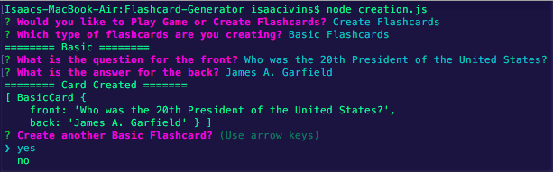

# Flashcard-Generator

**What Am I Looking At?**
This is a simple back-end Node.JS application used to both create flashcards and test the user on the information they provide. You can either "Play" or "Create" with two different types of flashcards. There are "Basic" flashcards that have a front and back, and "Clozecard" flashcards that remove a portion of a sentence provided from the user. Once creating the flashcards the user can either add more at anytime, or test their knoweledge by playing a game with the flashcards they provided. The flashcards are currently saved to a simple txt file, and refferenced later on when playing the game.

**What Did You Use To Make This?**\
1. Javascript
2. Node.JS
3. Npm Packages
* FS
* OS
* Inquirer

# Creating Flashcards (Basic/Clozecard)

By Selecting "Create Flashcards" you're given the option to create "Basic" or "Clozecard" Flashcards

**Basic Flashcards Example:**
Front: "Who is the 20th President of the United States?"
Back: "James A. Garfield"

Front = Question || Back = Answer

**Clozecard Flashcard Example:**
Full: "James A. Garfield was the 20th President of the United States."
Partial: "James A. Garfield"
Cloze: "... was the 20th President of the United States."

Cloze = Question || Partial = Answer

Once Selecting "Create Basic Flashcards" you are first prompted to enter the Front of the Flashcard (Question).

After entering the Front part of the Flashcard, the user is then propmted to enter the Back or the (Answer).

After entering the new Flashcard the user is prompted with option to either "Create Another Card" or not. Selecting no will bring the user to the "Play or Create" prompt from the begining.

The process for creating Clozecard Flashcards is almost exactly the same. The only difference is instead of the user inputting the "front"(questioin) and the "back"(answer), the user enters a full sentence and then the part of that sentence they would like to be removed. The full sentence minus the part they wanted removed appears as the "question" and the part removed is used at the "answer".

The first part of the user input is the sentence they need to remember. The second input from the user is the part of the first sentece they wish to remove for their clozecard flashcard.

There are 3 parts of the Clozecard Flashcard: "Full" is the entire sentence, "Cloze" is the part removed from full (answer), "Partial" the remaining sentence i.e full - cloze (question).

This is an example to show multiple clozecards created.

Creating new cards at any time will add to the existing Flashcards, not override them. The card information is currently stored on a txt file sheet, using node "fs" npm package to read and write to the file. Later on I will use MYSQL to porperly store flashcards into a database.

# Playing Game (Basic/Clozecard)

By Selecting "Play Game" the user is then asked to play with either Clozecard Flashcards or Basic Flashcards

If the user chosses to use "Basic Cards", the user is given the current score (correct) while prompted with the first question from the Basic Flashcards txt file. 

Once answered the user is informed wether thier responce was correct or incorrect. If correct the current score increments by 1. Once informed if they were correct or not, the next question gets asked from the Basic Flascards txt file. 

The app promps the user questions for each card in the basic flashcard file. Once they've all been answered the user is given the amount of thier current score. Since we only used 2 Basic Flashcards for this example, I answered 1 correct and 1 incorrect and the app prompted me with the results.

